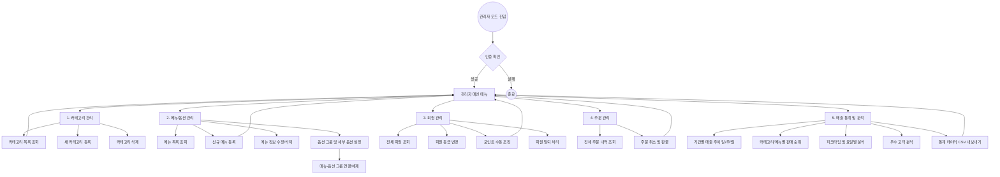

# 📊 카페 키오스크 관리자 기능 플로우 차트 (Admin Flow)

본 문서는 `AdminController.java`와 `AdminService.java`의 구현 내용을 바탕으로 관리자 기능의 전체 흐름을 시각화한 문서입니다.

## 1. 전체 관리자 기능 계층도 (Mermaid)

## 2. 주요 기능 상세 설명

### 🟢 카테고리 및 메뉴 관리
*   **카테고리 관리:** 키오스크의 대분류(커피, 에이드, 디저트 등)를 생성, 조회 및 삭제합니다.
*   **메뉴 등록 및 수정:** 특정 카테고리에 속하는 메뉴의 이름, 가격, 설명을 등록하고 품절 여부(`isAvailable`)를 관리합니다.
*   **옵션 그룹 연동:** 메뉴별로 '온도(Hot/Ice)', '사이즈(Regular/Large)' 등의 옵션 그룹을 다대다(M:N) 관계로 연결하여 유연한 옵션 구성을 지원합니다.

### 🔵 회원 및 주문 관리
*   **회원 등급 및 포인트:** 고객의 등급(Bronze/Silver/Gold)을 조정하고, 관리자가 직접 포인트를 지급하거나 차감할 수 있습니다. (지급 사유 기록 포함)
*   **주문 관리:** 전체 주문 내역을 실시간으로 확인하며, 결제된 주문을 취소하고 매출 데이터를 롤백하는 기능을 제공합니다.

### 📊 매출 통계 및 데이터 분석 (BI)
*   **시계열 분석:** 일별, 주별(월차트 변환 로직 포함), 월별 매출 추이를 분석하여 대시보드 형태로 제공합니다.
*   **인기 상품 분석:** 가장 많이 판매된 메뉴 TOP N과 카테고리별 매출 점유율을 계산합니다.
*   **피크타임 분석:** 시간대별(Hourly) 및 요일별(Day of Week) 매출 비중을 분석하여 운영 효율을 높이는 인사이트를 제공합니다.
*   **데이터 익스포트:** 모든 통계 데이터를 CSV 형식으로 내보내 외부 도구(Excel 등)에서 추가 분석이 가능합니다.

---
*Last Updated: 2026-03-18*
