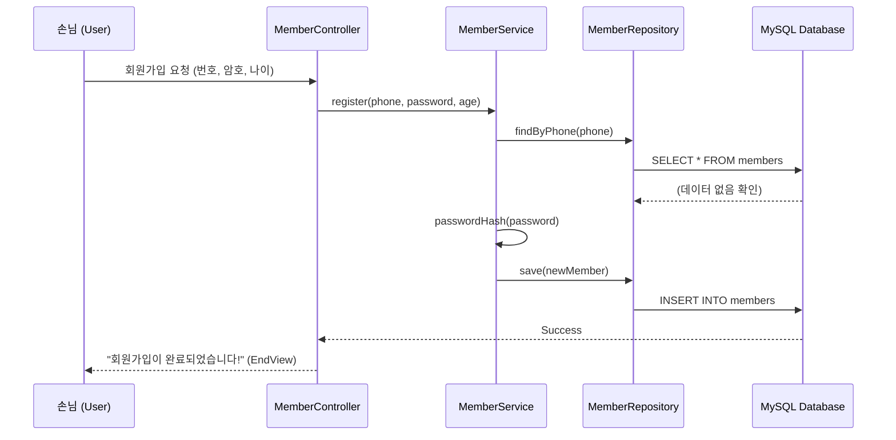
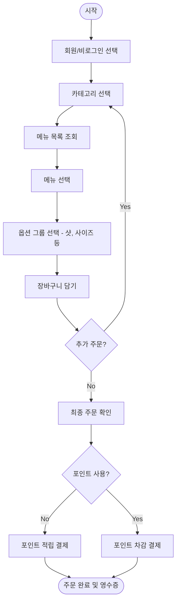

# 🎤 카페 키오스크 프로젝트 최종 발표 자료

본 문서는 프로젝트의 핵심 기능인 **회원가입, 주문, 관리자 기능**의 시나리오와 시스템 흐름을 정리한 발표용 자료입니다.

---

## 1️⃣ [회원가입 시나리오] 신규 고객 유입 및 멤버십 등록
"처음 방문한 손님이 카페 멤버십에 가입하고 환영 포인트(또는 등급)를 부여받는 과정"

### 🎬 시나리오 흐름
1.  **시작:** 손님이 키오스크 초기 화면에서 '회원가입' 버튼을 선택합니다.
2.  **정보 입력:** 휴대폰 번호, 비밀번호, 나이를 입력합니다. (선호 카테고리 선택 옵션 포함)
3.  **검증:** 시스템은 이미 가입된 번호인지 확인하고 비밀번호 유효성을 검사합니다.
4.  **완료:** 가입 성공 메시지와 함께 초기 등급(Bronze)이 부여됩니다.

### 🔄 시퀀스 다이어그램 (Sequence Diagram)

---

## 2️⃣ [주문 시나리오] 메뉴 선택부터 결제 및 포인트 적립
"로그인한 회원이 메뉴를 고르고, 옵션을 추가하여 장바구니에 담은 뒤 주문하는 메인 프로세스"

### 🎬 시나리오 흐름
1.  **로그인:** 휴대폰 번호로 로그인하여 기존 포인트 및 퀵오더 정보를 불러옵니다.
2.  **메뉴 탐색:** 카테고리를 선택하고 원하는 메뉴를 탐색합니다.
3.  **옵션 커스텀:** 메뉴 선택 시 '온도(Hot/Ice)', '샷 추가' 등 연결된 옵션 그룹을 선택합니다.
4.  **장바구니:** 장바구니에서 수량을 조절하거나 메뉴를 추가/삭제합니다.
5.  **최종 주문:** 포인트를 사용하거나 적립하며 주문을 완료합니다.

### 🔄 시스템 흐름 (Flowchart)

---

## 3️⃣ [관리자 시나리오] 매출 분석 및 서비스 운영 관리
"매니저가 당일 매출을 확인하고, 통계 데이터를 바탕으로 운영 전략을 수립하는 과정"

### 🎬 시나리오 흐름
1.  **인증:** 관리자 전용 코드로 로그인합니다.
2.  **매출 확인:** 일별/주별 매출 추이를 그래프나 표로 확인합니다.
3.  **운영 분석:** 피크타임(시간대별 매출) 및 인기 메뉴 TOP 5를 분석합니다.
4.  **데이터 익스포트:** 정산 보고서를 위해 전체 통계 데이터를 CSV 파일로 내보냅니다.
5.  **재고/메뉴 관리:** 품절된 메뉴를 일시 비활성화하거나 가격을 수정합니다.

### 🔄 관리자 액션 보드 (Admin Dashboard Concept)
| 기능 영역 | 주요 액션 | 기대 결과 |
| :--- | :--- | :--- |
| **매출 분석** | `showHourlySalesStatistics()` | 시간대별 주문 집중도 파악 (인력 배치 활용) |
| **메뉴 관리** | `updateMenu(isAvailable=false)` | 실시간 재고 부족 메뉴 판매 중단 |
| **회원 관리** | `updateMemberRole(Gold)` | 우수 고객 등급 상향 및 혜택 부여 |
| **정산 관리** | `exportStatistics()` | 외부 문서(Excel) 연동용 데이터 확보 |

---

## 💡 발표 팁 (Presentation Tips)
*   **기술적 차별점:** 단순히 CRUD만 하는 것이 아니라, **옵션 그룹과 메뉴의 다대다(N:M) 관계**를 어떻게 코드로 풀었는지 강조하세요.
*   **예외 처리:** "이미 가입된 회원", "포인트 부족" 등 **BusinessRuleException**을 통해 어떻게 견고하게 예외를 처리했는지 보여주면 좋습니다.
*   **사용자 경험:** **퀵오더(Quick Order)** 기능을 통해 이전 주문을 단 2번의 클릭으로 재주문할 수 있는 점을 어필하세요.

---
*Created by Gemini CLI Assistant for Cafe Kiosk Project*
